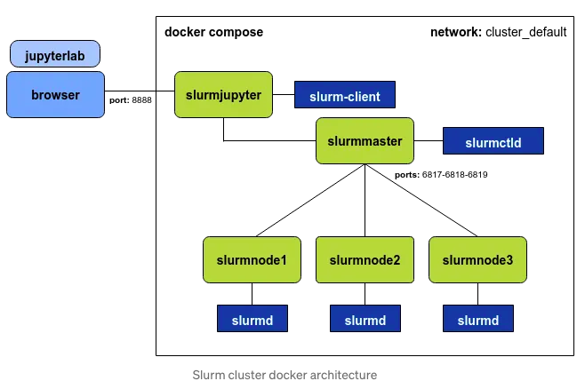

# Slurm Docker Project Technical Interview

This project presents a slurm cluster using docker containers.

* **Docker compose:** allows to create an environment from docker images previously built. Docker Composer will create containers as well an internal network to communicate the components.

* **SLURM:** It is a open-source cluster management and batch scheduler for linux hpc clusters.


## Project Content

### Components versions

* **Docker:**           25.0.3
* **Docker Compose:**   2.24.6
* **SLURM:**            21.08.6.1
* **OS:**               Rocky Linux release 8.9 (Green Obsidian)


## Cluster Architecture



* **mysql:** Slurm database.
* **slurmdbd:** Slurm DataBase Daemon is in change of recording accounting clusters information in a single database.
* **slurmctld:** Centralized manager that monitors resources and work.
* **slurmd:** Compute node daemon that waits for jobs, executes them and return the status. 
* **scratch_cluster_default:** Internal virtual network created by docker.


### Files

* **Dockerfile**

Contains the necessary commands to assemble a base image (slurm-cluster:rocky8). Packages installation, configuration files among other.
* **docker-compose.yml**

In this YAML file the cluster architecture is define to be later deployed in containers.
* **slurm.conf** 

Predefined ASCII file that escribes general slurm configuration information: nodes, partitions etc.
* **slurmdbd.conf**

Predefined file containing SLurm Database Daemon configuration information. This file is to be located in the same directory as slurm.conf file.
* **start_services.sh** 

Once the containers are launched, this script will initiate several services: sshd, munge, slurm services.

## Get Started 

* Clone the repository
```
git clone https://github.com/carlosbebe/scratch_cluster
```
* Create a sshk key pair
```
ssh-keygen -b 2048 -t rsa -f /Users/Carlos/scratch_cluster/id_rsa -q -N ""
```
* Build base rocky image
```
docker build -t slurm-cluster:rocky8 .
```
* Initiate docker composer
```
docker compose up -d
```
* Accessing the loggin node
```
docker exec -it slurmctld bash
docker exec -u carlos -it slurmctld bash
```

* Testing slurm
```
sinfo
srun hostname
```

* Other useful commands

```
docker-compose logs -f
docker ps
docker images
docker rmi -f 27a7f9a9ac17
docker system prune
docker exec slurmctld bash -c "`linux command"
docker compose stop
docker compose start
docker compose restart
```
## Additional Components that can be implemented

* High Availability
* slurmrestd 
* Monitoring system
* ldap authentication
* Security hardening 

