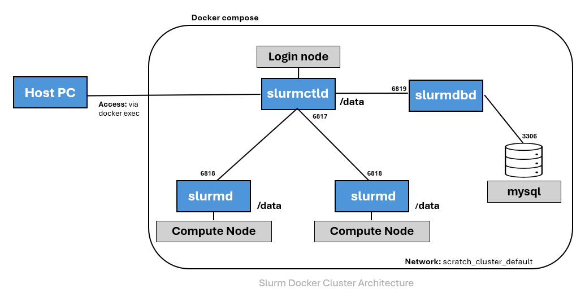

# Slurm Docker Project

This project presents a slurm cluster using docker containers.

* Docker compose: It allows to create an environment from docker images previously built. Docker Composer will create containers as well an internal network to communicate the components.

* SLURM: It stands for Simple Linux Utility for Resource Management. It is a open-source cluster management and batch scheduler for linux hpc clusters.


## Project Content
Docker Version
SLURM Version
OS Version

* Dockerfile
* docker-compose.yml
+ slurm.conf 
+ slurmdbd.conf
+ start_services.sh 

## Cluster Architecture
!!!!!!!!!!!!! Add Graph!!!!!!!!!!!!!!!!!


The compose file will run the following containers:

* mysql
* slurmdbd   
* slurmctld  
* (slurmd)node1 - Compute node.
* (slurmd)node2 - Compute node. 


## Get Started 


```console
docker build -t slurm-cluster:rocky8 .
docker compose up -d
docker exec -it slurmctld bash

docker-compose logs -f
docker ps
docker images
docker rmi -f 27a7f9a9ac17
docker system prune
docker build -t  .
```


```console
docker-compose stop
docker-compose start
```

```console
docker-compose restart
